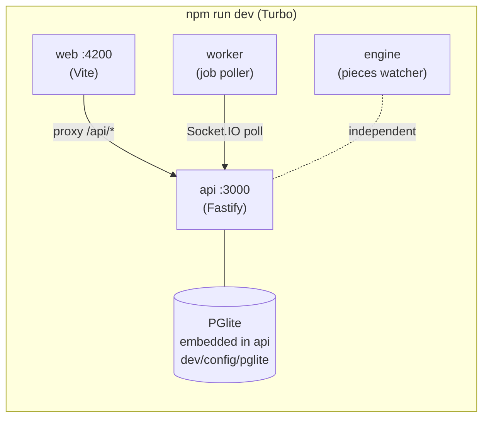
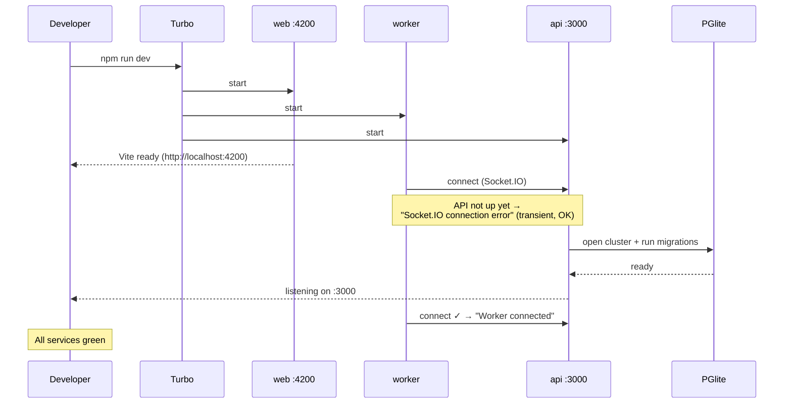
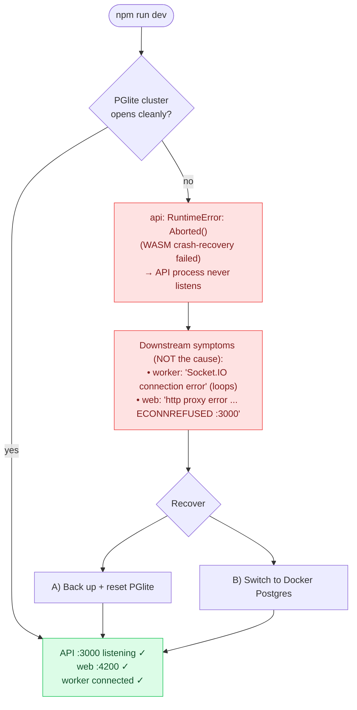
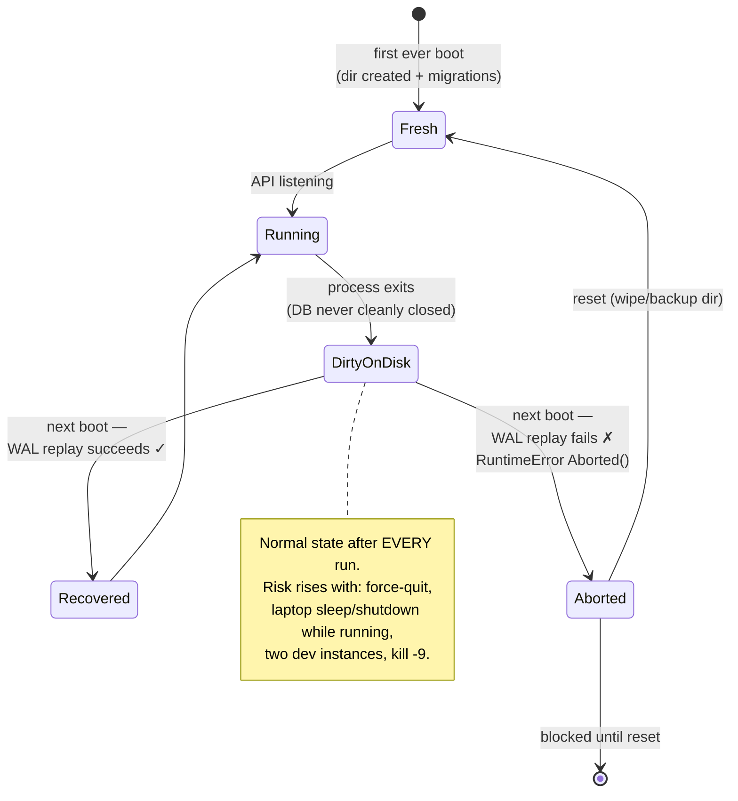

# `npm run dev` — Startup Scenarios (UX Reference)

> **Purpose.** A reference for design/UX of how the local dev server boots, the states it can be in, and where it fails today. Use it to design clearer terminal output, status indicators, and guided-recovery flows. Each scenario is mapped to a **UI state** (loading / success / error / recovering) so it can be wired to existing prototype components (`pf-status-pill`, `pf-card`, `pf-app-shell`).
>
> **Audience.** UI/UX + anyone improving the local dev experience.
> **Status.** Captured 2026-06 from a real failure: a corrupted PGlite dev DB caused `npm run dev` to crash on first run of the day.

---

## 1. What `npm run dev` actually does

It launches **four services in parallel** via Turbo:

| Service | Port | Role | Depends on |
| --- | --- | --- | --- |
| `web` | `4200` | Vite frontend; proxies `/api/*` → `:3000` | API (for live data, not to boot) |
| `api` | `3000` | Fastify backend + **embedded PGlite database** | the PGlite data dir on disk |
| `engine` | — | Compiles/watches pieces | — |
| `worker` | — | Polls API for jobs over Socket.IO | API |

The key fact for every scenario below: **the database (PGlite) runs *inside* the `api` process.** There is no separate DB server in the default dev setup. If the DB can't open, the **API never starts**, and everything that depends on the API looks broken even though it is fine.



---

## 2. Scenario A — Success (happy path)

**UI state: `loading` → `ready`.**

Boot order matters: `web`, `engine`, and `worker` come up in seconds; `api` is slowest because it opens the DB and runs migrations. Until the API is listening, the worker and web frontend **emit connection errors that are expected and harmless**.



**Signals that it worked**
- `web:serve: VITE ... ready` + `Local: http://localhost:4200/`
- `api:serve: ... Worker connected` and `[workerRpc#poll] Poll request received`
- `GET /api/v1/flags` → **HTTP 200**
- Worker's earlier `Socket.IO connection error` lines **stop**.

> **UX note.** The transient worker/Vite errors during a *successful* boot are indistinguishable from a real failure to a newcomer. See §6.

---

## 3. Scenario B — Failure (corrupted PGlite database)

**UI state: `error` (root cause) + a lot of `error` noise (downstream).**

This is the failure we hit. The PGlite cluster on disk was left in a dirty state by a previous unclean shutdown; on the next boot, PGlite's WebAssembly engine **aborts during crash recovery** instead of replaying its write-ahead log.



**Root-cause signal (the one line that matters):**
```
api:serve: [main#start] Failed to start server
api:serve:   err: { "type": "RuntimeError", "message": "Aborted(). Build with -sASSERTIONS for more info." }
api:serve:     at ... @electric-sql/pglite ... Function.create
```

**Misleading noise (everything else):** repeated `worker: Socket.IO connection error` and `web: ECONNREFUSED 127.0.0.1:3000`. These are just "the API isn't up" — they are **symptoms, not causes**, and they dominate the terminal.

> **Why it's not the developer's fault.** The corruption is written at *shutdown* of a *previous* session. The failing `npm run dev` is simply the first boot to open the already-broken cluster. See §5 for the root mechanism.

---

## 4. Database lifecycle — the state model

This is the heart of the problem and the most useful thing for UX to internalize. **Every shutdown looks like a crash to PGlite**, because the server exits without cleanly closing the DB connection (it tears down Redis, locks, and watchers in its `onClose` hook, but never destroys the TypeORM DataSource). Recovery *usually* succeeds — until it doesn't.



---

## 5. Why it happens (root mechanism, for accurate copy)

- Default dev uses **PGlite** (`AP_DB_TYPE=PGLITE` in `.env.dev`): Postgres compiled to WebAssembly, running **inside the API process**. Data dir: `dev/config/pglite`.
- On exit (`SIGINT`/`SIGTERM` → `app.close()`), the server closes Redis, the distributed lock, system jobs, and the engine watcher — **but never closes/destroys the database connection.** The process just `process.exit(0)`s.
- So PGlite is **never cleanly shut down**; the next boot must run crash recovery (WAL replay). Real Postgres does this reliably; PGlite's WASM build does it *most* of the time, and occasionally `Aborted()`s.
- PGlite ships **no `pg_resetwal`** or repair tooling, so an aborted cluster **cannot be fixed in place** — it must be reset.

**Behaviours that raise the odds** (none guarantees corruption; careful shutdown only *reduces* risk because the DB isn't flushed even on a clean Ctrl+C):
- Force-quitting the terminal / closing the window instead of `Ctrl+C`
- Sleeping or shutting down the machine while `npm run dev` runs
- Running two `npm run dev` instances against the same data dir
- `kill -9`

---

## 6. UX opportunities

The current experience: a wall of red, the real error buried in the middle, no guidance, and it reads as "you broke it" on the first command of the day. Concrete improvements, mapped to states and existing prototype components:

### 6.1 Separate root cause from downstream noise
- **Problem:** worker `Socket.IO` + Vite `ECONNREFUSED` errors flood the log during *both* a normal boot and a real failure.
- **Design:** while the API is not yet listening, render those as a **calm "waiting for API…" state**, not red errors. Only escalate to red if the API process **exits**.
- **Component:** `pf-status-pill` per service — `API`, `Database`, `Worker`, `Web` — each `pending → ok → error`.

### 6.2 Surface a single, friendly root-cause card
- Detect the `PGlite ... Aborted()` signature and replace the raw stack with a **`pf-card`**:
  - **Title:** "Local database couldn't start"
  - **Cause (plain):** "Your dev database was left in an unrecoverable state by a previous shutdown. This isn't caused by today's command."
  - **Primary action:** "Reset database (keeps a backup)" → runs the backup+reset.
  - **Secondary action:** "Use Docker Postgres instead" → link to §7B.

### 6.3 A boot status panel (app-shell)
- In `pf-app-shell`, a startup overlay listing the four services with live pills and the public URL once `web` is ready. Turns "is it working?" into a glance instead of log-reading.

### 6.4 Guided recovery, not manual surgery
- One action performs: stop processes → `mv dev/config/pglite dev/config/pglite.corrupt-backup-<date>` → restart. Confirm dialog must state **"this starts an empty database — you'll re-onboard; the old data is backed up, not deleted."**

### 6.5 Post-reset onboarding cue
- After a reset the DB is empty. Show a one-line banner: "Fresh dev database — sign-up/onboarding will run again." Prevents "where did my flows go?" confusion.

### 6.6 Prevention (engineering, but shapes UX)
- Cleanly close the DataSource on shutdown so PGlite gets a proper checkpoint (removes most corruption), **and/or** recommend Docker Postgres for anyone who hits this twice.

### State → UI mapping (cheat sheet)

| Scenario | State | What the user sees today | Target UX |
| --- | --- | --- | --- |
| Booting, API not up yet | `loading` | Red worker/Vite errors | Calm "starting…" pills |
| All services up | `ready` | Mixed logs; must spot the 200 | Green panel + clickable `:4200` |
| PGlite aborted | `error` | Wall of red, cause buried | Single root-cause card + actions |
| Resetting | `recovering` | Manual commands | Progress + "backup kept" note |
| Fresh DB after reset | `ready (empty)` | No cue; data "gone" | Onboarding banner |

---

## 7. Recovery runbook (reference)

**A) Back up + reset (non-destructive, recommended)**
```bash
# stop the dev run first, then:
mv dev/config/pglite dev/config/pglite.corrupt-backup-$(date +%Y-%m-%d)
npm run dev            # API recreates the dir + runs migrations (empty DB)
```

**B) Switch to a real Postgres (robust; corruption class goes away)**
```bash
docker compose -f docker-compose.dev.yml up -d   # Postgres :5432 + Redis :6379
```
Then in `.env.dev`:
```
AP_DB_TYPE=POSTGRES
AP_POSTGRES_HOST=localhost
AP_POSTGRES_PORT=5432
AP_POSTGRES_DATABASE=activepieces
AP_POSTGRES_USERNAME=postgres
AP_POSTGRES_PASSWORD=A79Vm5D4p2VQHOp2gd5
```
A separate Postgres server survives the Node process exiting, so the "DB never cleanly closed" problem becomes a non-issue. (It's a different, empty DB → you re-onboard.)

**Verify (either path)**
```bash
curl -s -o /dev/null -w "%{http_code}\n" http://127.0.0.1:3000/api/v1/flags   # → 200
curl -s -o /dev/null -w "%{http_code}\n" http://localhost:4200/               # → 200
```

---

## 8. Quick reference — files & signals

| Thing | Value |
| --- | --- |
| DB data dir (PGlite) | `dev/config/pglite` (`CONFIG_PATH=dev/config`) |
| DB selector | `AP_DB_TYPE` = `PGLITE` \| `POSTGRES` (`.env.dev`) |
| DB connection code | `packages/server/api/src/app/database/pglite-connection.ts` |
| Shutdown path | `packages/server/api/src/main.ts` → `app.ts` `onClose` (DataSource **not** closed) |
| Docker dev DB | `docker-compose.dev.yml` (Postgres 14.4 + Redis 7) |
| Success signal | `Worker connected`; `GET /api/v1/flags` → 200 |
| Failure signal | `RuntimeError: Aborted()` from `@electric-sql/pglite` |
| Noise (ignore) | worker `Socket.IO connection error`; web `ECONNREFUSED :3000` |
